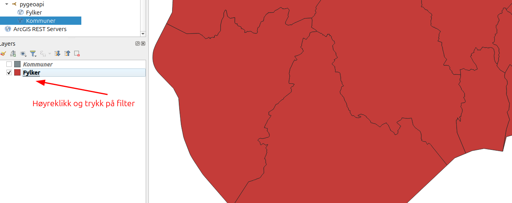
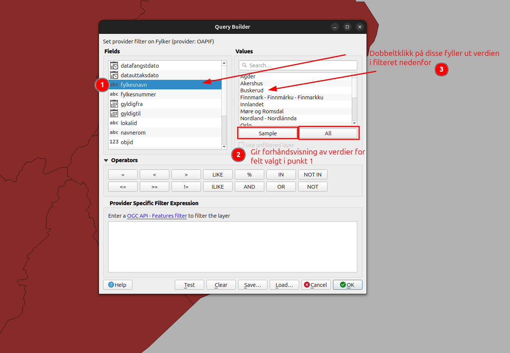
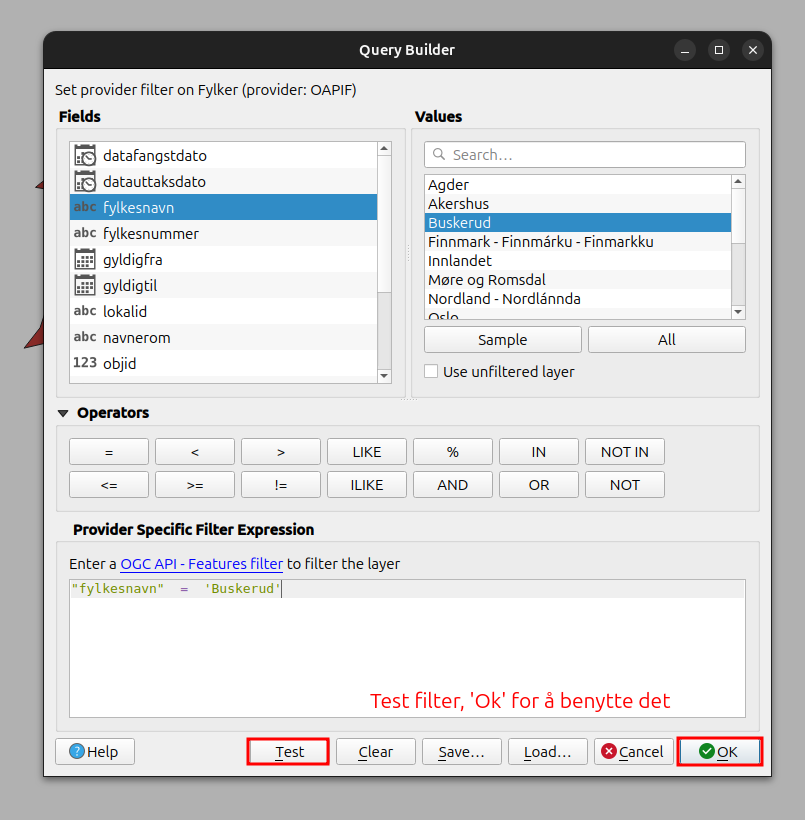

# Utforsk api'et!

Nå har vi satt opp api'et med våre egne data i en lokal postgis database og touchet borti konfigurasjonsfilen til pygeoapi.
Vi tenker det er fint som siste delen av workshoppen å gjøre seg litt mer kjent med api'et.
Denne øvingen og de neste øvingene er litt mer frie. Ta gjerne friheten til å hoppe mellom de siste øvingene og se på det som kan virke interessant, eller bare utforsk pygeoapi på egenhånd.

## 4.1 Klikk deg litt rundt

Nå kan du klikke deg rundt og utforske ulike deler av api'et.

Under API Definition på hovedsiden ligger det link til api dokumentasjon med swagger. (http://localhost:5000/openapi?f=html) (obs. redoc varianten funker ikke, vi skylder på geopython her)
Her kan man utforske de ulike endepunktene til api'et.

Under collections ligger datasettene våre. Under queryables ligger feltene man kan benytte i spørringer.

## 4.2 Bli mer kjent med og gjør gjerne endringer i konfigurasjonsfilen

Vil du kanskje gjøre noen endringer som å endre beskrivelser legge til keywords eller din kontaktinfo? Det kan gjøres i pygeoapi_config.yml filen, etterfulgt av en `docker compose restart pygeoapi_ws`

## 4.3 Vis dataene i Qgis/Arcgis (ev. annet)

💡 Dersom du ikke har Qgis eller arcgis installert kan du hoppe videre til [øving 5](oving5.md)

Du kan også koble deg opp til api'et med Qgis eller arcgis.

For Qgis:

## 4.4 Filtrer dataene i Qgis

Man kan sette opp filter i Qgis for å filtrere API'et på gitte verdier. Det kan ofte være lurt dersom man kun er interessert i visse deler av et tungt datasett.
Filteret kan enten settes i dialogen Layer->Add Layer->Add WFS/OGC API(anbefalt, men litt tyngre dialog), eller direkte på laget etter import som vist i bilder under.

Merk! Avhengig av hvordan filteret settes opp så vil Qgis enten filtrere rett i API'et, eller laste inn alle dataene for så å filtrere de. I sistnenvte scenario vil man ikke få raskere svar fra api'et.

